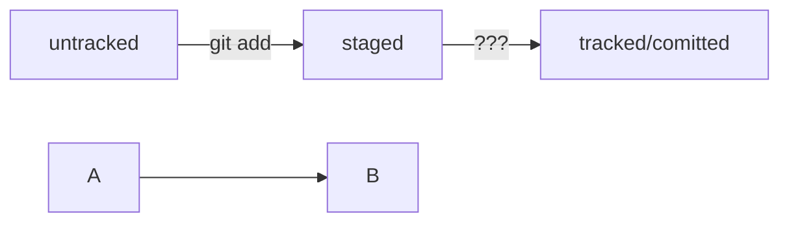

## Синхронизация репозиториев
// Что такое синхронизация репозиториев GIT?

## [Что такое SSH. Генерируем SSH-ключ](https://practicum.yandex.ru/trainer/git-basics/lesson/42435683-0922-4231-bfb4-d7d32d61f50a/)  
// перешли в домашнюю директорию  
cd ~   
// вывели список созданных ключей  
ls -la .ssh/  
// Для генерации SSH-пары можно использовать программу ssh-keygen  
ssh-keygen -t ed25519 -C <электронная почта, к которой привязан ваш аккаунт на GitHub>  
// или  
ssh-keygen -t rsa -b 4096 -C <электронная почта, к которой привязан ваш аккаунт на GitHub>  
// После ввода отобразится такое сообщение.  
> Generating public/private rsa key pair. // сгенерированы публичный и приватный ключи  
// программа запросит путь для сохранения ключа и кодовую фразу(можно оставить пустой)  
// проверить что ключи сгенерировались  
ls -a ~/.ssh   

## [Привязываем SSH-ключ к GitHub](https://practicum.yandex.ru/trainer/git-basics/lesson/4d662a58-3602-4c5c-9fad-be8cff334f37/)  
// скопировать содержимое ключа в буфер обмена:
pbcopy < ~/.ssh/id_rsa.pub  
// или вручную  
cat ~/.ssh/id_rsa.pub  
// Перейдите на GitHub и выберите пункт Settings (англ. «настройки») в меню аккаунта.  
// В меню слева нажмите на пункт SSH and GPG keys.  
// В открывшейся вкладке выберите New SSH key (англ. «новый SSH-ключ»).  
// В поле Title (англ. «заголовок») напишите название ключа. Например, Personal key (англ. «личный ключ»).  
// В поле Key type (англ. «тип ключа») должно быть Authentication Key (англ. «ключ аутентификации»).  
// В поле Key скопируйте ваш ключ из буфера обмена.  
// Нажмите на кнопку Add SSH key (англ. «добавить SSH-ключ»).  
// Проверьте правильность ключа с помощью следующей команды.  
ssh -T git@github.com  
	yes  

## [Связываем локальный и удалённый репозитории](https://practicum.yandex.ru/trainer/git-basics/lesson/19d174db-bd33-4307-a8e7-61b749a1639c/)  
// перейти в проект на компьютере локально  
cd ~/dev/first-project  
// привязать дальний репозиторий(хранилище)  
git remote add origin git@github.com:atutsasha/first-project.git  
// посмотреть связанные репозитории  
git remote -v  

## [Синхронизируем локальный и удалённый репозитории](https://practicum.yandex.ru/trainer/git-basics/lesson/89142add-f139-4c26-a467-4628eac2d0a7/ )
git push -u origin main  
// Если команда приведёт к ошибке, попробуйте  
// заменить main на master.  

## [Файл README.md](https://practicum.yandex.ru/trainer/git-basics/lesson/c6b9607c-e8bc-4446-89f9-c74522c3492f/)  
## [Практическая работа №1. «Делимся проектом с миром»](https://practicum.yandex.ru/trainer/git-basics/lesson/b980e3ff-cbc1-4c3d-87f9-8d708e9e121d/)  
## [Исследуем лог](https://practicum.yandex.ru/trainer/git-basics/lesson/2e019bb7-08bf-49ed-9860-26c0bdd8fe8a/)
// получить сокращенный лог  
git log --oneline --graph
// выход из просмотра логов
q  

## [Соглашение о коммитах](https://www.conventionalcommits.org/ru/v1.0.0-beta.4/#спецификация)  
## [Mermaid](https://github.blog/2022-02-14-include-diagrams-markdown-files-mermaid/)  

## [Как исправить коммит](https://practicum.yandex.ru/trainer/git-basics/lesson/298b9e02-74a7-43be-8056-5780c0e04985/)  
// добавить файл или изменения но оставить имя коммита прежним  
git commit --amend --no-edit  
// переименовать коммит
git commit --amend -m 'Переименовать коммит'  
// для выхода из редактра Vim нажимаем клавишу Esc  
:qa! - выход из Vim  
Исправили.

## [Как откатиться назад, если «всё сломалось»](https://practicum.yandex.ru/trainer/git-basics/lesson/78d6157b-a248-4c26-a2f8-5b7bdf270bc4/)  
// переведёт файл из staged обратно в modified или untracked.  
// обратная команде git add < file >  
Команда git restore --staged < file >  
Команда git reset --hard < commit hash > «откатит» историю до коммита с хешем <hash>. Более поздние коммиты потеряются!  
Команда git restore < file > «откатит» изменения в файле до последней сохранённой (в коммите или в staging) версии.  
 

 ## [Практическая работа №3. Нужно откатить изменения](https://practicum.yandex.ru/trainer/git-basics/lesson/2b9999de-518a-4911-a330-a1f084bb281e/)  

## [Просматриваем изменения в файлах](https://practicum.yandex.ru/trainer/git-basics/lesson/253d39f1-cdff-4cb8-8172-f0630ece3a3c/)  
git diff < коммит1 > < коммит2 >  
git diff --staged  

## [Игнорирование файлов в Git](https://practicum.yandex.ru/trainer/git-basics/lesson/92ba6ab8-c151-45ad-a0be-ffa4de31c537/)  
<!-- этого не видно в Markdown -->
.gitignore // создаём файл  
// если строка начинается с # (решётки) то это комментарий  
.DS_Store // просто игнорируем файл в корневой и во вложенных папках  
*.jpeg  // игнорировать все файлы которые заканчиваются на .jpeg  
!doge.jpeg // игнорировать файл не игнорировать точно, добавляет исключения из установленных правил
docs/*/tmp  // игнорировать все файлы "tmp" во всех первых подпапках папки docs/  но не в самой папке docs/
// Например: docs/current/tmp проигнорируется  
// Вопросительный знак соответсвует одному сиволу например проигнрирует file1.txt и file3.txt, но не file12.txt  
file?.txt  
// В квадратных скобках указывается один из игнорируемых символов   
file[0-7].txt  
/todo.txt - только в корневой директории  
build/ - игнорировать папку build  
docs/ ** /tmp - игнорировать в папке и всех подпапках папки docs/  
### Примеры
build/ - игнорировать все файлы в катологе build/  
*.log - игнорировать все файлы *.log  
!examples/**/*.log - не игнорировать в папках examples  
// показать все файлы и игнорируемые тоже  
git status --ignored  

## [Практическая работа №4. Исследуем историю коммитов](https://practicum.yandex.ru/trainer/git-basics/lesson/461a4637-c2f7-45a8-babe-a711822fac1b/)

## [Шпаргалка. Начало работы с Git](https://practicum.yandex.ru/trainer/git-basics/lesson/b1ecee27-bb78-46a0-8d13-0364c7803f55/)  

# Основы работы с ветками в Git  
## [Введение. О чём этот модуль.](https://practicum.yandex.ru/trainer/git-basics/lesson/4491f257-8bda-451a-bd41-a970ecbae9c2/)  

## [Практическая работа №1. Скачиваем репозиторий мечты](https://practicum.yandex.ru/trainer/git-basics/lesson/1322677b-dc83-4019-b9ec-4ebebd99dcdc/)

## [Что такое ветка](https://practicum.yandex.ru/trainer/git-basics/lesson/e24f2080-0f2e-4f48-8d18-629ca1ad47fd/)  
$ mkdir learn_branches && cd learn_branches && git init // создали новый репозиторий  
$ touch README.md // создали файл  
$ git add . // команда git add с флагом-точкой подготовит к сохранению текущую папку; вместо этого можно вызвать git add --all  
$ git commit -m "Выполнить первый коммит"  
$ git branch   
* main // мы в основной ветке  
// чтобы выйти из просмотра веток, может понадобиться Q!  
$ git add . && git commit -m "Обновить README"   

## [Создаём ветку](https://practicum.yandex.ru/trainer/git-basics/lesson/c821887b-df5f-41de-a569-043a3cd6ae7d/)  
$ git branch feature/add-branch-info // создали ветку feature/add-branch-info  
$ git branch // посмотрели ветки  

## [Шагаем с ветки на ветку](https://practicum.yandex.ru/trainer/git-basics/lesson/210ad536-f27e-4265-a891-54e913a33f91/)  
$ git checkout feature/add-branch-info // перешли в новую ветку  
Switched to branch 'feature/add-branch-info'  
$ git checkout -b bugfix/fix-branch // создали ветку и сразу на неё переключились  
Switched to a new branch 'bugfix/fix-branch'  

  
## [Сравниваем ветки](https://practicum.yandex.ru/trainer/git-basics/lesson/52d55cb1-6b66-4bcf-ac12-d4dfd574d628/)  
$ git diff HEAD~ HEAD   
git diff main~3 main  

  
## [Практическая работа №2. Помогаем другу разобраться в ветках](https://practicum.yandex.ru/trainer/git-basics/lesson/624ddde6-b3ea-4834-87fb-e9919c07fd52/) 

## [How do I clone all remote branches?](https://stackoverflow.com/questions/67699/how-do-i-clone-all-remote-branches)  
git clone git://example.com/myproject  
git branch -a   # увидеть все ветки даже дальние
To take a quick peek at an upstream branch, check it out directly:  
$ git checkout origin/experimental  
To work on that branch, create a local tracking branch, which is done automatically by:  
$ git checkout experimental  

  
## [Объединяем и удаляем ветки](https://practicum.yandex.ru/trainer/git-basics/lesson/60a94ca8-1517-45bd-9d23-ceb1538f4727/)  
git merge <название ветки> # слияние веток  
git branch -D <название ветки> # безопаснее с флагом -d  

  
## [7.8 Инструменты Git - Продвинутое слияние](https://git-scm.com/book/ru/v2/Инструменты-Git-Продвинутое-слияние)

  
## [Обратно на GitHub](https://practicum.yandex.ru/trainer/git-basics/lesson/74a3cc13-8fb2-4fcf-8d5d-fcdd8ec0f3c6/)  
создать на GitHub новый репозиторий git-branches  
загрузить в него локальный проект git-branches  
git remote add origin git@github.com:%ИМЯ_АККАУНТА%/git-branches.git  
git push -u origin main  
git checkout main  
git checkout -b feature/merge-request  
git push origin feature/merge-request # отправить ветку feature/merge-request на GitHub  

## [Создаём pull request](https://practicum.yandex.ru/trainer/git-basics/lesson/8a758c45-1455-4c29-9bcc-ec5318f193ef/)
Залили изменеия из основной ветки в свою  
и отправляем её в дальний репозиторий  
делаем Pull Request (на сайте) с целью ознакомить других разработчиков и получить их одобрение  

## [Забираем изменения из удалённого репозитория](https://practicum.yandex.ru/trainer/git-basics/lesson/bd52c59c-ae07-4f8e-8e1c-23942fa3ffab/)  
$ git checkout main # перешли в main (выбираем ветку изменения которой мы хотим проверить)  
$ git pull # подтянули новые изменения в main  
$ git checkout my-branch # вернулись в рабочую ветку my-branch  
$ git merge main # влили main в новую ветку my-branch  
$ git push -u origin my-branch # отправили ветку my-branch в удалённый репозиторий   

## [Практическая работа №4. Выходим из отпуска — и узнаём, что проект изменился](https://practicum.yandex.ru/trainer/git-basics/lesson/e84cc2b7-58ad-45c9-808e-133d09d03672/)  
$ git remote rm origin # эта команда удалит текущий origin  
$ git remote add origin git@github.com:%ВАШ_АККАУНТ%/github-case.git 
$ git push -u origin feature/my-branch  
создаём Pull Request

 
## [Что такое fast-forward](https://practicum.yandex.ru/trainer/git-basics/lesson/8ce6c2e4-12e8-4e8b-ac9d-940b3ac05b51/)  
// находимся в ветке main  
// --no-edit отключает ввод сообщения для merge-коммита  
// --no-ff отключает fast-forward слияние веток  
$ git merge --no-edit --no-ff add-docs  
// с флагом --graph  
// Git нарисует ветки с помощью «палочек» и «звёздочек»  
// получившийся коммит слияния: 6814789  
$ git log --graph --oneline  
// fast-forward можно отключить «навсегда»   
merge.ff: git config [--global] merge.ff false  

## [Non-fast-forward](https://practicum.yandex.ru/trainer/git-basics/lesson/15902634-386d-439c-879c-405b37f834d1/)  
// команде git log можно указать несколько веток,  
// и тогда она выведет их все  
$ git log --graph --oneline main add-docs  
// находимся в ветке main  
// --no-edit избавляет от необходимости  
// вводить сообщение для merge-коммита  
$ git merge --no-edit add-docs  

## [git push и fast-forward](https://practicum.yandex.ru/trainer/git-basics/lesson/5b367127-af6d-4a2c-8c48-1582a7156ff4/)  
// просто «выкинет» (удалит) коммит D и запишет в main@origin коммиты из main  
git push --force   

## [Работа с PR: практика](https://practicum.yandex.ru/trainer/git-basics/lesson/f1ba7b87-c4ea-4e6a-9406-0ec8fe2bdd82/)  
https://github.com/yandex-praktikum/git-course-pr-example  
$ git checkout main && git pull  
$ git push --set-upstream origin HEAD  
 ИЛИ  
$ git push -u origin feature-goose-poem  
// делаем Pull Request  
// После «мёржа» PR рекомендуем обновить локальную main:  
$ git checkout main && git pull  

## [Разрешение конфликта вручную и через vimdiff](https://practicum.yandex.ru/trainer/git-basics/lesson/df8f8fed-e3f8-44bd-90e4-3e67bc02e507/)  
$ mkdir git-conflict && cd git-conflict && git init && git branch -m main && \  
echo 'main version' > readme.md && git add . && git commit -m 'main' && \  
git checkout -b br1 && echo 'version 1' > readme.md && git add . && git commit -m 'v1' && \  
git checkout main && \  
git checkout -b br2 && echo 'version 2' > readme.md && git add . && git commit -m 'v2'  && \  
git checkout main && git merge br1 && \  
git checkout main && git merge br2 && \  
& git status  
// Подготовьте изменения к сохранению и сделайте коммит.  
$ git add . && git commit --no-edit    
// Имитируем конфликт из урока и вызываем vimdiff  
git mergetool  
// Команды git gl не существует в Git  
[почитать в документации.](https://git-scm.com/book/en/v2/Git-Basics-Git-Aliases)  
git log --oneline --abbrev-commit --graph --date=short --pretty=format:'%h - %an, %cd : %s'  

## [Разрешение конфликта через Visual Studio Code](https://practicum.yandex.ru/trainer/git-basics/lesson/653d1bce-8700-46db-8ddd-cf39a0575a1f/)  

## [Что делать, если основная ветка «убежала» вперёд в процессе ревью](https://practicum.yandex.ru/trainer/git-basics/lesson/5047356e-92e7-492a-9158-85d3647b25fc/)  
Перейти в ветку main.  
Загрузить новые изменения из неё с помощью git pull. При этом вы также загрузите ветку вашего коллеги.  
Снова перейти в вашу ветку feature/my-new-awesome-code.  
Выполнить git merge main и разрешить конфликт локально. В результате будет создан локальный коммит слияния.  
Отправить изменения из вашей ветки в репозиторий с помощью git push. Так коммит слияния попадёт в удалённый репозиторий и в пул-реквест.  

## [Шпаргалка. Командная работа в Git](https://practicum.yandex.ru/trainer/git-basics/lesson/cb64571e-3cc2-4259-8561-3e432b4b99c1/)  
1. Склонировать репозиторий.  
1.1 Если вы не участник проекта, предварительно сделать «форк» исходного репозитория.  
1.2 На странице репозитория или «форка» нажать кнопки: Code → SSH → скопировать ссылку.  
1.3 Выполнить команду git clone <ссылка на репозиторий>.  
2. Создать ветку для вашей задачи: git checkout -b my-task-branch-name.  
3. Добавить и «закоммитить» изменения, которые вы хотите внести в проект.  
4. «Запушить» ветку: git push --set-upstream origin HEAD или git push -u origin my-task-branch-name.  
4.1 GitHub (с помощью Git) выведет ссылку на создание PR. По ней нужно перейти.  
4.2 PR можно также создать через интерфейс GitHub.  
5. Сообщить о пул-реквесте ревьюеру.  
5.1 Иногда ревьюеры назначаются автоматически, тогда сообщать не нужно.  
6. Обсуждать с ревьюером предлагаемые изменения и вносить правки, пока эти изменения не будут одобрены (пока не будет получен «апрув»).    
6.1. Если кто-то добавил конфликтующие изменения в main, пока ваш PR был на ревью, нужно разрешить конфликт:    
  Обновить main: git checkout main && git pull.  
  Влить main в свою ветку: git checkout my-task-branch-name && git merge main.  
  Разрешить конфликты слияния с помощью IDE или вручную.  
  Создать коммит слияния: git commit --no-edit или git commit -m 'merge main'.  
  Сделать git push своей ветки.  
7. Нажать кнопку Merge или подождать, пока её нажмёт кто-то ещё.  
8. Ещё раз обновить main, чтобы «подтянуть» ваши изменения в основную ветку локального репозитория: git checkout main && git pull.  
9. Вы великолепны! Можете начинать снова со второго пункта.  

### Алгоритм-шпаргалка для разрешения конфликтов слияния
1. Открыть проект в IDE (VS Code, IDEA или другие).
2. Открыть файл, в котором есть конфликт.
3. Выбрать, какие части файла нужно взять из одной ветки, а какие — из другой.
4. Когда конфликты разрешены, сделать коммит: git commit --no-edit или git commit -m 'merge branch <название ветки>'.
