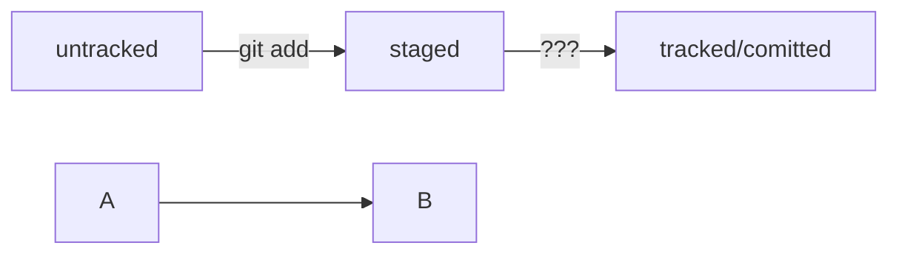

## Связываем локальный и удалённый репозитории
https://practicum.yandex.ru/trainer/git-basics/lesson/19d174db-bd33-4307-a8e7-61b749a1639c/  
$  
ssh-keygen -t ed25519 -C atutsasha@gmail.com  
cat ~/.ssh/ed25519.pub  
ssh -T git@github.com  
	yes  
cd ~/dev/first-project  
git remote add origin git@github.com:atutsasha/first-project.git  
git remote -v  

## Синхронизируем локальный и удалённый репозитории
https://practicum.yandex.ru/trainer/git-basics/lesson/89142add-f139-4c26-a467-4628eac2d0a7/  
$  
git push -u origin main  
Если команда приведёт к ошибке, попробуйте  
заменить main на master.  

## Исследуем лог
$  
git log --oneline  
q  

## Соглашение о коммитах  
https://www.conventionalcommits.org/ru/v1.0.0-beta.4/#спецификация  

## Mermaid  
https://github.blog/2022-02-14-include-diagrams-markdown-files-mermaid/  

## Как исправить коммит  
git commit --amend --no-edit  
git commit --amend -m 'Переименовать коммит'  
Esc :qa! - выход из Vim  
Исправили.

## [Как откатиться назад, если «всё сломалось»](https://practicum.yandex.ru/trainer/git-basics/lesson/78d6157b-a248-4c26-a2f8-5b7bdf270bc4/)  
Команда git restore --staged <file> переведёт файл из staged обратно в modified или untracked.  
Команда git reset --hard <commit hash> «откатит» историю до коммита с хешем <hash>. Более поздние коммиты потеряются!  
Команда git restore <file> «откатит» изменения в файле до последней сохранённой (в коммите или в staging) версии.  

## Просматриваем изменения в файлах  
git diff <коммит1> <коммит2>  
git diff --staged  

## [Игнорирование файлов в Git](https://practicum.yandex.ru/trainer/git-basics/lesson/92ba6ab8-c151-45ad-a0be-ffa4de31c537/)  
.gitignore  
*.jpeg  
!doge.jpeg - инвертировать игнорирование  
docs/*/tmp  
file?.txt  
file[0-7].txt  
/todo.txt - только в корневой директории  
build/ - игнорировать папку build  
docs/**/tmp - игнорировать в папке и подпапках  
*.log - игнорировать все  
!examples/**/*.log - не игнорировать в папках examples  
git status --ignored  

## [Шпаргалка. Начало работы с Git](https://practicum.yandex.ru/trainer/git-basics/lesson/b1ecee27-bb78-46a0-8d13-0364c7803f55/)  

## [Что такое ветка](https://practicum.yandex.ru/trainer/git-basics/lesson/e24f2080-0f2e-4f48-8d18-629ca1ad47fd/)
$ mkdir learn_branches && cd learn_branches && git init # создали новый репозиторий
$ touch README.md # создали файл

$ git add . # команда git add с флагом-точкой подготовит к сохранению текущую папку; вместо этого можно вызвать git add --all
$ git commit -m "Выполнить первый коммит"

$ git branch 
* main # мы в основной ветке

// чтобы выйти из просмотра веток, может понадобиться Q!
$ git add . && git commit -m "Обновить README" 

[Создаём ветку](https://practicum.yandex.ru/trainer/git-basics/lesson/c821887b-df5f-41de-a569-043a3cd6ae7d/)
$ git branch feature/add-branch-info # создали ветку feature/add-branch-info
$ git branch # посмотрели ветки

[Шагаем с ветки на ветку](https://practicum.yandex.ru/trainer/git-basics/lesson/210ad536-f27e-4265-a891-54e913a33f91/)
$ git checkout feature/add-branch-info # перешли в новую ветку
Switched to branch 'feature/add-branch-info'
$ git checkout -b bugfix/fix-branch # создали ветку и сразу на неё переключились
Switched to a new branch 'bugfix/fix-branch'

[Сравниваем ветки](https://practicum.yandex.ru/trainer/git-basics/lesson/52d55cb1-6b66-4bcf-ac12-d4dfd574d628/)
$ git diff HEAD~ HEAD 
git diff main~3 main

[Практическая работа №2. Помогаем другу разобраться в ветках](https://practicum.yandex.ru/trainer/git-basics/lesson/624ddde6-b3ea-4834-87fb-e9919c07fd52/)
[How do I clone all remote branches?](https://stackoverflow.com/questions/67699/how-do-i-clone-all-remote-branches)
git clone git://example.com/myproject
git branch -a
To take a quick peek at an upstream branch, check it out directly:
$ git checkout origin/experimental
To work on that branch, create a local tracking branch, which is done automatically by:
$ git checkout experimental

[Объединяем и удаляем ветки](https://practicum.yandex.ru/trainer/git-basics/lesson/60a94ca8-1517-45bd-9d23-ceb1538f4727/)
git merge <название ветки> # слияние веток
git branch -D <название ветки> # безопаснее с флагом -d

[7.8 Инструменты Git - Продвинутое слияние][https://git-scm.com/book/ru/v2/Инструменты-Git-Продвинутое-слияние]

