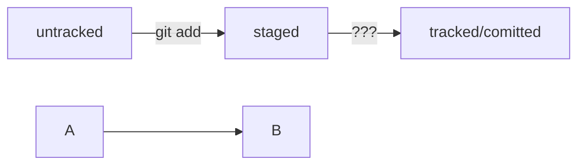

## Связываем локальный и удалённый репозитории
https://practicum.yandex.ru/trainer/git-basics/lesson/19d174db-bd33-4307-a8e7-61b749a1639c/  
$  
ssh-keygen -t ed25519 -C atutsasha@gmail.com  
cat ~/.ssh/ed25519.pub  
ssh -T git@github.com  
	yes  
cd ~/dev/first-project  
git remote add origin git@github.com:atutsasha/first-project.git  
git remote -v  

## Синхронизируем локальный и удалённый репозитории
https://practicum.yandex.ru/trainer/git-basics/lesson/89142add-f139-4c26-a467-4628eac2d0a7/  
$  
git push -u origin main  
Если команда приведёт к ошибке, попробуйте  
заменить main на master.  

## Исследуем лог
$  
git log --oneline  
q  

## Соглашение о коммитах  
https://www.conventionalcommits.org/ru/v1.0.0-beta.4/#спецификация  

## Mermaid  
https://github.blog/2022-02-14-include-diagrams-markdown-files-mermaid/  

## Как исправить коммит  
git commit --amend --no-edit  
git commit --amend -m 'Переименовать коммит'  
Esc :qa! - выход из Vim  
Исправили.

## [Как откатиться назад, если «всё сломалось»](https://practicum.yandex.ru/trainer/git-basics/lesson/78d6157b-a248-4c26-a2f8-5b7bdf270bc4/)  
Команда git restore --staged <file> переведёт файл из staged обратно в modified или untracked.  
Команда git reset --hard <commit hash> «откатит» историю до коммита с хешем <hash>. Более поздние коммиты потеряются!  
Команда git restore <file> «откатит» изменения в файле до последней сохранённой (в коммите или в staging) версии.  

## Просматриваем изменения в файлах  
git diff <коммит1> <коммит2>  
git diff --staged  

## [Игнорирование файлов в Git](https://practicum.yandex.ru/trainer/git-basics/lesson/92ba6ab8-c151-45ad-a0be-ffa4de31c537/)  
.gitignore  
*.jpeg  
!doge.jpeg - инвертировать игнорирование  
docs/*/tmp  
file?.txt  
file[0-7].txt  
/todo.txt - только в корневой директории  
build/ - игнорировать папку build  
docs/**/tmp - игнорировать в папке и подпапках  
*.log - игнорировать все  
!examples/**/*.log - не игнорировать в папках examples  
git status --ignored  

## [Шпаргалка. Начало работы с Git](https://practicum.yandex.ru/trainer/git-basics/lesson/b1ecee27-bb78-46a0-8d13-0364c7803f55/)  

